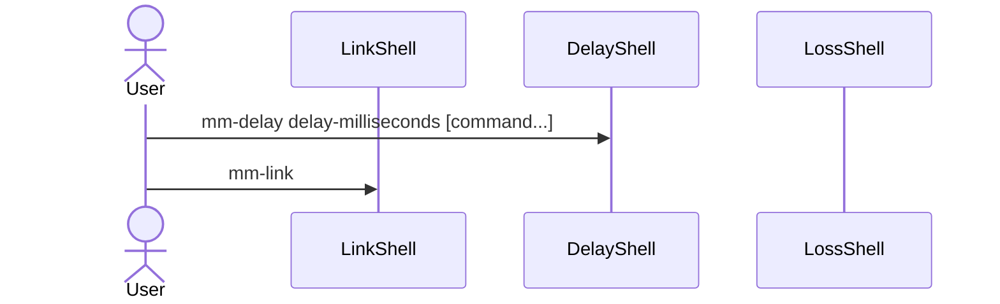
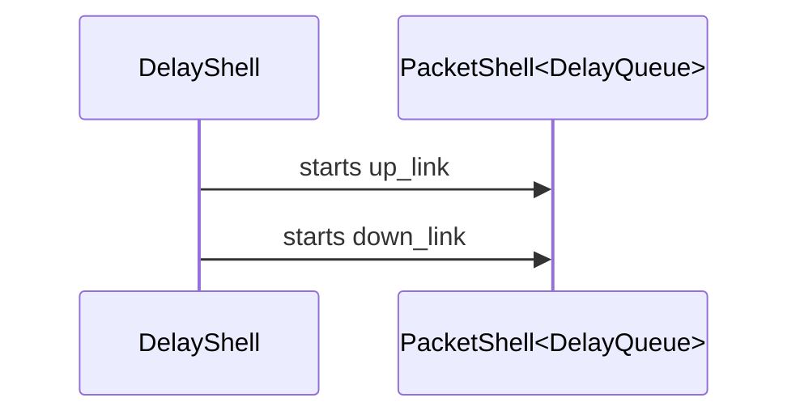
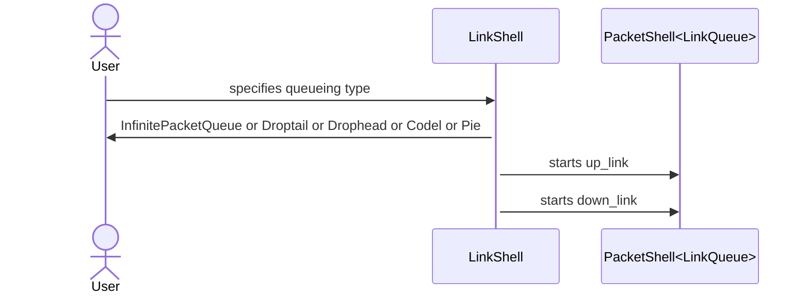

# Control Flow

# DelayShell

# LinkShell

- required argument: `uplink-log, downlink-log, uplink-queue, downlink-queue, uplink-queue-args, downlink-queue-args`
- no argument: `once, meter-uplink, meter-downlink, meter-uplink-delay, meter-downlink-delay, meter-all`
